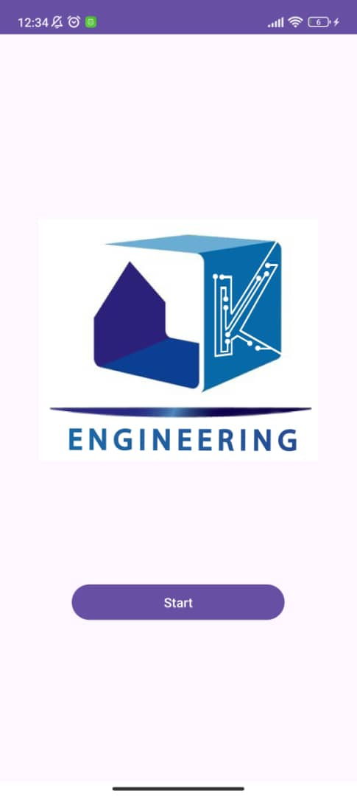
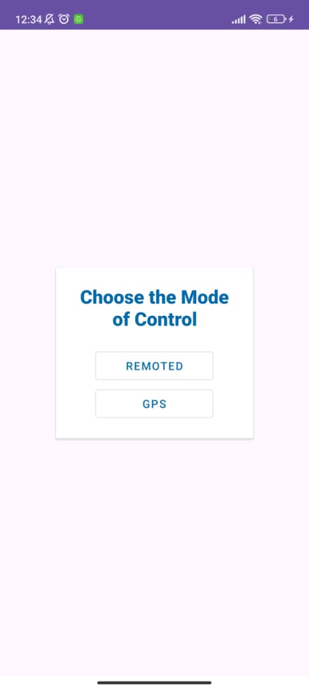
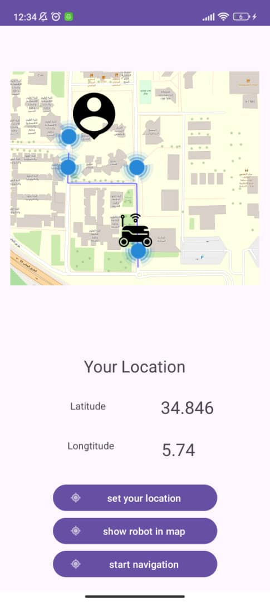
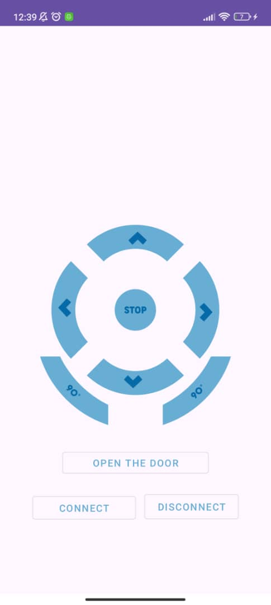

## Kcube Controller Unit 

this Application is a Controller Unit of a Delivery Robot Prototype 'KCube' made in University of Biksra 
the application connect with the  internal arduino bluetooth board HC05 through bluetooth sockets 

## Demonstration 

## Features 
 - All Direction Controls with of the Delivery Robot(Forward , Backawrds , Left ,Right ,90° Left/Right)
 - Ability to Open the Lid in order to Claim the Package
 - Location retrieval of the robot , user and the ability to draw route between the robot and user
## Screenshots 

## perspective

 we aim to build a platform specefied to for robot delivery managmnet between all parts of our university where this application is a the users entry point wehre they rent a robot and guide it to their end destination

### How to setup

    the current version allows only  for static pairing to the bluettoh board , and in order to do that : 
    1 - turn on your bluettoh and connect it 
    1- go to remotedActivity.java 

## Contributors 
  Abbderahmane Kermiche [@Kr-abdou](https://github.com/Kr-Abdou) : UI/UX Design

 Chabi Amin [@Amine200s](https://github.com/Amine2000s) : Development 

## License

This project is licensed under the GNU General Public License v3.0 - see the [LICENSE](./LICENSE.md) file for details.

This project includes the "OSM Bonus Pack" library which is licensed under the GNU GPL v3.0. For more information, see the [OSM Bonus Pack](https://github.com/MKergall/osmbonuspack) repository.
